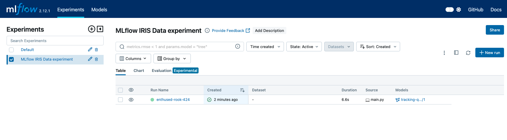
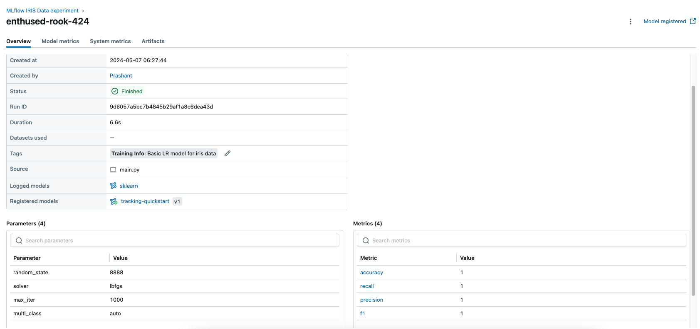

## MLFlow Basics

In this project, we will see how MLFlow is used for experiment tracking.  
We will look at 3 different types of tracking :  
* __Local tracking__ : MLFLow will save tracking information locally on your computer, and only you can view this information.  
* __Dagshub tracking__ : MLFlow will save tracking information on Dagshub site. This is useful if you want to do experiment tracking, 
and make your results publicly available.  
* __AWS tracking__ : Here will we will setup MLFlow on AWS, and push our experiment's data to AWS, and make it shareable with team/colleagues/selected group of people.  


#### Steps for Local Tracking

* Create virtual environment `python -m venv venv`  
* Activate virtual environment `source venv/bin/activate`  
* Start local MLFLow server `mlflow server --host 127.0.0.1 --port 8080`, you will see a mlruns folder created in directory after this. This folder stores experiment tracking data organized under folders.   
* Run `python src/main.py --mode local`, you will see output as below:  
```
python src/main.py --mode local
2024/05/07 06:27:44 INFO mlflow.tracking.fluent: Experiment with name 'MLflow IRIS Data experiment' does not exist. Creating a new experiment.
Successfully registered model 'tracking-quickstart'.
2024/05/07 06:27:51 INFO mlflow.store.model_registry.abstract_store: Waiting up to 300 seconds for model version to finish creation. Model name: tracking-quickstart, version 1
Created version '1' of model 'tracking-quickstart'.
``` 
* Visit `http://127.0.0.1:8080` to visualize the data saved in mlruns folder  

__Run Info__  

  

__Run Details__  

  


#### Steps for Dagshub Tracking  

* Visit `www.dagshub.com`, signup with your github account. Create a repository by connecting to github and select an existing repository.  
* Enable MLFlow on your project from below location  
)  
* Set environment variables provided to you in mlflow integration steps, run below commands in your shell. The MLflow clients depend on environment variables to configure a remote tracking server. Make sure your environment variables are set every time you want to use MLflow.  
```
export MLFLOW_TRACKING_URI=https://dagshub.com/prazjain/python-mlflow-basics.mlflow
export MLFLOW_TRACKING_USERNAME=prazjain
export MLFLOW_TRACKING_PASSWORD=PUT-YOUR-PASSWORD-HERE
```  
* Run the application `python src/main.py --mode dagshub`, you would see an output like below  
```
2024/05/08 12:16:29 INFO mlflow.tracking.fluent: Experiment with name 'MLflow IRIS Data experiment' does not exist. Creating a new experiment.
Successfully registered model 'tracking-quickstart'.
2024/05/08 12:16:45 INFO mlflow.store.model_registry.abstract_store: Waiting up to 300 seconds for model version to finish creation. Model name: tracking-quickstart, version 1
Created version '1' of model 'tracking-quickstart'.
```  
* Navigate to project expirement page on dagshub, and explore from there. You can also navigate to MLFlow UI page from here and you will see detailed view similar to your local run. MLFlow UI Page is also shareable publicly, so others can follow your progress, useful for working within teams also.  
  
https://dagshub.com/prazjain/python-mlflow-basics.mlflow/#/experiments/0  
